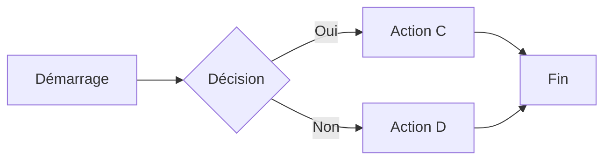

# Guide Complet du Markdown avec Exemples

## Syntaxe de base

Markdown est conçu pour être facile à lire et à écrire.

**Exemple :**
Voici du texte simple en Markdown. Les paragraphes sont séparés par une ligne vide.

Ceci est un nouveau paragraphe.

## En-têtes

```markdown
# H1 - Titre principal

## H2 - Sous-titre

### H3 - Sous-sous-titre

#### H4 - Niveau 4

##### H5 - Niveau 5

###### H6 - Niveau 6
```

## Emphase

```markdown
_Texte en italique_ ou _Texte en italique_
**Texte en gras** ou **Texte en gras**
**_Texte en gras et italique_** ou **_Texte en gras et italique_**
~~Texte barré~~
```

**Exemple rendu :**

_Texte en italique_ ou _Texte en italique_
**Texte en gras** ou **Texte en gras**
**_Texte en gras et italique_** ou **_Texte en gras et italique_**
~~Texte barré~~

## Listes

### Liste non ordonnée

```markdown
- Élément 1
- Élément 2
  - Élément 2a
  - Élément 2b
```

**Exemple rendu :**

- Élément 1
- Élément 2
  - Élément 2a
  - Élément 2b

Autres symboles pour les listes non ordonnées :

```markdown
- Élément avec tiret
- Autre élément
  - Sous-élément

* Élément avec plus
* Autre élément
```

**Exemple rendu :**

- Élément avec tiret
- Autre élément
  - Sous-élément

* Élément avec plus
* Autre élément

### Liste ordonnée

```markdown
1. Premier élément
2. Deuxième élément
3. Troisième élément
   1. Sous-élément 3.1
   2. Sous-élément 3.2
```

**Exemple rendu :**

1. Premier élément
2. Deuxième élément
3. Troisième élément
   1. Sous-élément 3.1
   2. Sous-élément 3.2

### Liste de définition

```markdown
Markdown
: Langage de balisage léger

HTML
: Langage de balisage pour les pages web
```

## Liens

### Liens simples

```markdown
[Site de Google](https://www.google.com)
[Mozilla Developer Network](https://developer.mozilla.org "Documentation MDN")
```

**Exemple rendu :**
[Site de Google](https://www.google.com)
[Mozilla Developer Network](https://developer.mozilla.org "Documentation MDN")

### Liens de référence

```markdown
[Référence à Wikipedia][wiki]
[Autre référence][docs]

[wiki]: https://www.wikipedia.org "Wikipedia"
[docs]: https://docs.github.com "Documentation GitHub"
```

### Liens automatiques

```markdown
<https://www.example.com>
<contact@example.com>
```

**Exemple rendu :**
<https://www.example.com>
<contact@example.com>

## Images

### Image simple

```markdown


```


### Image avec référence

```markdown
![Logo référencé][logo]

[logo]: https://markdown-here.com/img/icon256.png "Logo Markdown"
```

### Image cliquable

```markdown
[](https://markdown-here.com)
```

## Code et Mise en forme

### Code inline

```markdown
Utilisez la fonction `print()` pour afficher du texte en Python.
```

**Exemple rendu :**
Utilisez la fonction `print()` pour afficher du texte en Python.

### Blocs de code

````markdown
```
Bloc de code sans coloration syntaxique
Plusieurs lignes de code
```

```javascript
// Bloc de code JavaScript
function bonjour() {
  console.log("Bonjour le monde!");
}
```

```python
# Bloc de code Python
def bonjour():
    print("Bonjour le monde!")
```
````

**Exemple rendu :**

```
Bloc de code sans coloration syntaxique
Plusieurs lignes de code
```

```javascript
// Bloc de code JavaScript
function bonjour() {
  console.log("Bonjour le monde!");
}
```

```python
# Bloc de code Python
def bonjour():
    print("Bonjour le monde!")
```

### Indentation de code

```markdown
    # Ceci est un bloc de code
    # indenté avec 4 espaces
    print("hello world")
```

**Exemple rendu :**

    # Ceci est un bloc de code
    # indenté avec 4 espaces
    print("hello world")

## Citations

```markdown
> La simplicité est la sophistication suprême.
>
> — Leonardo da Vinci

> Citation principale
>
> > Citation imbriquée
> >
> > > Citation doublement imbriquée
```

**Exemple rendu :**

> La simplicité est la sophistication suprême.
>
> — Leonardo da Vinci

> Citation principale
>
> > Citation imbriquée
> >
> > > Citation doublement imbriquée

## Lignes horizontales

```markdown
---
---

---
```

**Exemple rendu :**

---

---

---

## Tableaux

```markdown
| Produit | Prix unitaire | Quantité |
| ------- | ------------- | -------- |
| Pommes  | 1,20 €        | 4        |
| Oranges | 0,95 €        | 10       |
| Bananes | 0,75 €        | 6        |
```

**Exemple rendu :**

| Produit | Prix unitaire | Quantité |
| ------- | ------------- | -------- |
| Pommes  | 1,20 €        | 4        |
| Oranges | 0,95 €        | 10       |
| Bananes | 0,75 €        | 6        |

### Alignement des colonnes

```markdown
| Gauche | Centre | Droite |
| :----- | :----: | -----: |
| Text   |  Text  |   Text |
| 123    |  456   |    789 |
```

**Exemple rendu :**

| Gauche | Centre | Droite |
| :----- | :----: | -----: |
| Text   |  Text  |   Text |
| 123    |  456   |    789 |

## Cases à cocher

```markdown
- [x] Créer la structure HTML
- [x] Concevoir le CSS
- [ ] Implémenter JavaScript
- [ ] Tester sur différents navigateurs
```

**Exemple rendu :**

- [x] Créer la structure HTML
- [x] Concevoir le CSS
- [ ] Implémenter JavaScript
- [ ] Tester sur différents navigateurs

## Mentions et références

```markdown
@github-username

Issue #123
PR #456
```

## Fonctionnalités étendues

### Retour à la ligne

```markdown
Première ligne.\
Deuxième ligne sans paragraphe.
```

**Exemple rendu :**

Première ligne.\
Deuxième ligne sans paragraphe.

Ou deux espaces à la fin d'une ligne:

```markdown
Première ligne.
Deuxième ligne.
```

## HTML dans Markdown

```markdown
<div style="color: red;">
  Ce texte sera rouge.
</div>

<details>
  <summary>Cliquez pour voir plus d'informations</summary>

Des informations détaillées qui apparaissent uniquement quand on clique sur le résumé.

</details>
```

**Exemple rendu :**

<div style="color: red;">
  Ce texte sera rouge.
</div>

<details>
  <summary>Cliquez pour voir plus d'informations</summary>

Des informations détaillées qui apparaissent uniquement quand on clique sur le résumé.

</details>

### Personnaliser du texte

```markdown
Normal <sup>Exposant</sup> <sub>Indice</sub>

<kbd>Ctrl</kbd>+<kbd>C</kbd> pour copier
```

**Exemple rendu :**

Normal <sup>Exposant</sup> <sub>Indice</sub>

<kbd>Ctrl</kbd>+<kbd>C</kbd> pour copier

## Notes de bas de page

```markdown
Voici une phrase avec une note de bas de page[^1].

[^1]: Contenu de la note de bas de page.
```

## Macros spéciales

### Emojis

```markdown
J'adore utiliser Markdown :heart: c'est tellement :+1: !
```

**Exemple rendu (si supporté) :**
J'adore utiliser Markdown :heart: c'est tellement :+1: !

### Diagrammes

````markdown

````

**Exemple rendu (si supporté) :**


### Mise en évidence de texte

```markdown
==Texte surligné== (supporté dans certains parseurs)
```

### Formules mathématiques

```markdown
Équation simple: $E = mc^2$

Formule complexe:

$$
\frac{d}{dx}(e^x) = e^x
$$
```

## Tags et étiquettes

### Tags avec hashtags

```markdown
#markdown #documentation #guide
```

### Tags YAML

```markdown
---
title: "Mon article"
date: 2023-10-18
tags:
  - markdown
  - documentation
  - tutoriel
categories:
  - Développement
---

Contenu de l'article ici...
```

### Tags sous forme de badges

```markdown


```

**Exemple rendu:**


### Tags avec lien

```markdown
[#markdown](#markdown) [#guide](#guide) [#documentation](#documentation)
```

**Exemple rendu:**

[#markdown](#markdown) [#guide](#guide) [#documentation](#documentation)
